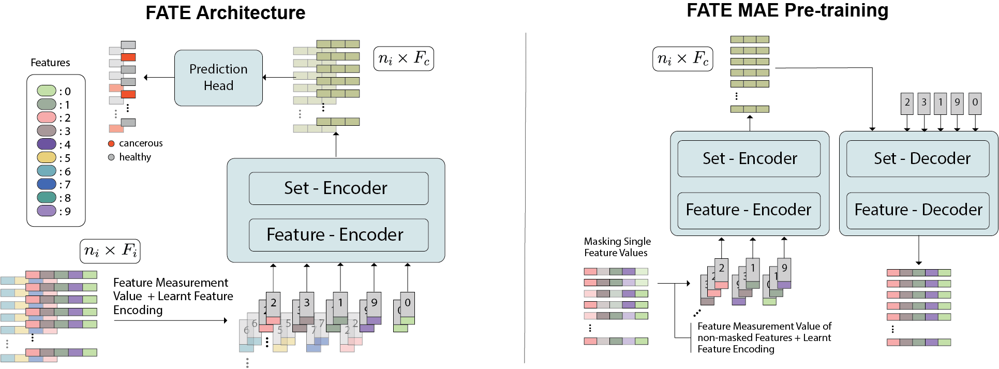

# FATE

This is the official Pytorch implementation of our work *FATE: Feature-Agnostic Transformer-based Encoder for learning generalized embedding spaces in flow cytometry data* accepted at WACV 2024. 

## Overview

<strong>FATE</strong> is a novel architecture that can process data with varying features, without the need to constrain the input space to the intersection of potential feature sets or to expand it to their union. For more information please refer to the [arXiv paper](https://arxiv.org/abs/2311.03314).




---
## Setup 🛠
Clone the repository, create environment and install the required packages as follows:
```bash
git clone git@github.com:lisaweijler/FATE.git # clone repository
cd FATE # change directory
python -m venv .venv # create new virtual environment
source .venv/bin/activate # activate it
pip install -r requirements.txt # install requirements
```

---

## Run FATE 🚀
In this section you will find information on how to use this repository.  In particular, how to apply the proposed pre-training strategy, fine-tune and test the model.

### General information ⚙️
* **Config files**  In the folder `config_templates` 3 templates for pre-training, fine-tuning and training from scratch are provided. Those can be used as a starting point for your own experiments and adjusted as needed. 
* **Data** This project works with preloaded flow cytometry samples saved via pickle as pandas dataframes. To preload (including compensation, transformation and scaling) the package [flowmepy](https://pypi.org/project/flowmepy/) was used. The config files expect a "preloaded_data_dir" argument, where the path to the folder with the preloaded samples is specified. The path "data_splits_dir" should lead to a folder containing three *.txt files (train.txt and eval.txt are needed during training, while test.txt is needed during testing), where every line contains the path to a FCM file (.xml or .analysis). Those file paths in the *.txt files are used to load the correct files from the "preloaded_data_dir". In the folder `data_splits` an example is given. The vie14, bln and bue data from our work can be downloaded from [here](https://flowrepository.org/id/FR-FCM-ZYVT).
* **Marker dictionary** In the folder `marker_dicts` the Marker/Feature dictionary is saved specifying all features used.

### Pre-training 🚀
Example command for pre-training FATE:
```
python pretrain.py --config config_templates/pretrain_FATEMaskedAE_config.json --device 0
```
### Fine-tuning & Training from scratch 🚀
For fine-tuning and training from scratch the file `train.py` can be used. If in the config a "pretrained_model_path" is given then the model is initialized with the pretrained weights of the specified model.

Example command for fine-tuning FATE:
```
python train.py --config config_templates/finetune_pretrained_FATE_config.json --device 0
```

Example command for fine-tuning FATE:
```
python train.py --config config_templates/train_FATE_config.json --device 0
```
### Testing 📊
For testing you can use the same config as for training/fine-tuning and specify the model to use via the command line and the --resume flag.
Example command for testing FATE:
```
python train.py --config /caa/Homes01/lweijler/phd/myeflow/development/FATE/config_templates/train_FATE_config.json --device 0 --resume path/to/your/trained/model.pth
```

## Citation :pray:

If you use this repository please consider citing our work

```
@inproceedings{weijler2024fate,
  title={FATE: Feature-Agnostic Transformer-based Encoder for learning generalized embedding spaces in flow cytometry data},
  author={Weijler, Lisa and Kowarsch, Florian and Reiter, Michael and Hermosilla, Pedro and Maurer-Granofszky, Margarita and Dworzak, Michael},
  booktitle={Proceedings of the IEEE/CVF Winter Conference on Applications of Computer Vision},
  pages={7956--7964},
  year={2024}
}
```
